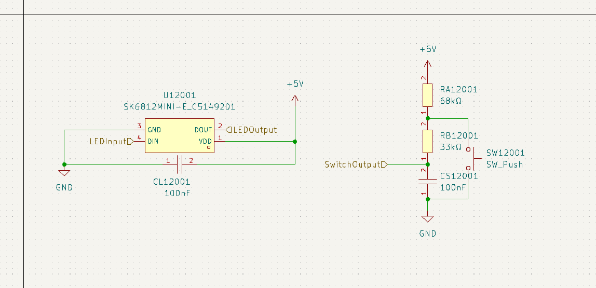
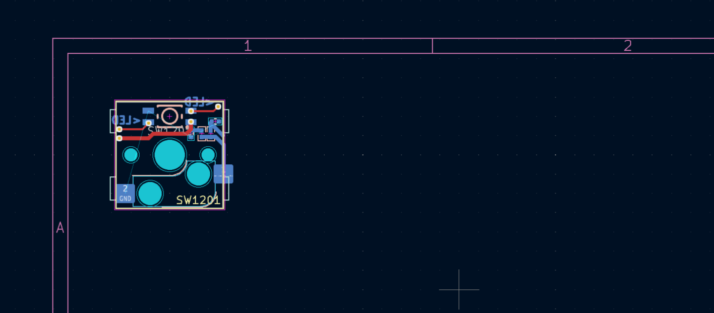
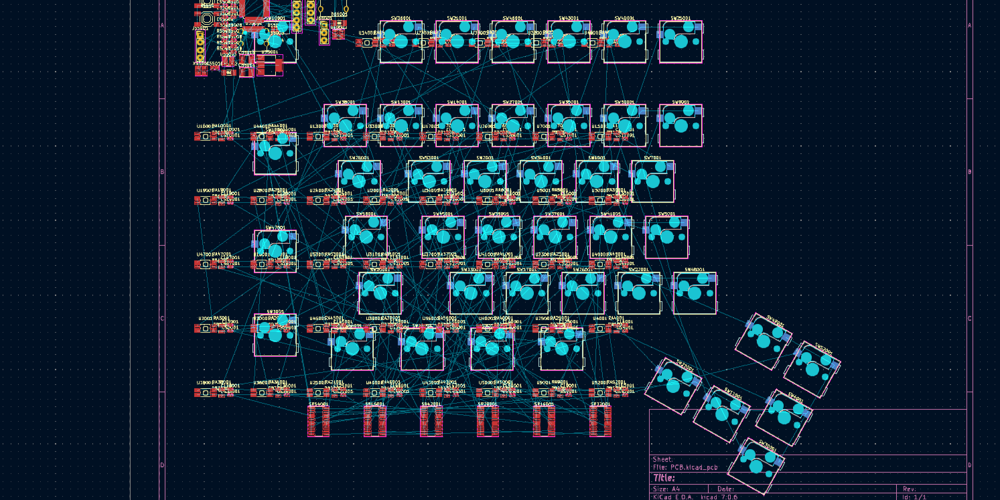
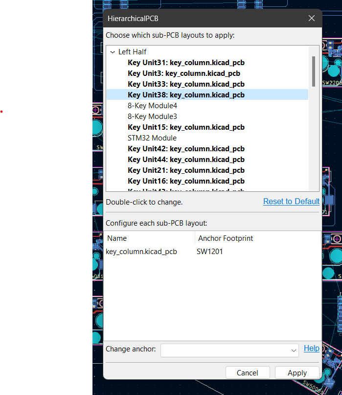
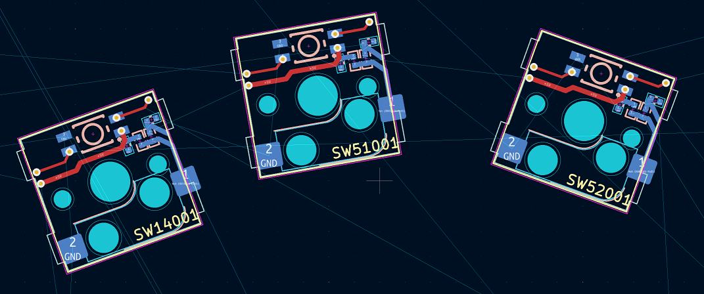

# HierarchicalPcb

This provides a true hierarchical PCB layout engine in KiCad, mirroring its hierarchical schematic capabilities.

Instead of laying out everything in your final file, you can define a sub-PCB next to your sub-schematic file, and HierarchicalPCB will automatically force the sub-PCB to be laid out exactly like that in the final PCB. There's no depth limitation to the nesting -- in fact, we encourage organizing your PCB layouts for maximum reusability.

This is inspired by the venerable [`ReplicateLayout`](https://github.com/MitjaNemec/ReplicateLayout) plugin, and is intended to be a more modular, powerful, and flexible replacement.

**Installation**:

This requires KiCad 8 to run. For now, you have to manually download or clone this repository to the plugin directory. On Windows, this is `C:\Users\<Username>\Documents\KiCad\8.0\3rdparty\plugins`.

I'm working on getting this deployed to the official repository or on hosting my own.

## How To Use

In summary:

1. Organize your schematic into hierarchical sheets, as you would normally do.
2. Create a `.kicad_pcb` file next to a hierarchical sheet and set up the placement of the sub-PCB there.

   a. You should create a project file to help with the placement.
   b. Any footprints missing from the sub-PCB (but present in the schematic) will be ignored during automatic placement.
   c. Any footprints present in the sub-PCB but missing from the main PCB will be ignored.
   d. Any footprints placed off to the left or above the origin will be ignored during automatic placement.

3. Open the main PCB and run the plugin.
4. Select which hierarchical sheets you want to enforce the layout of, and configure which footprint to use as the anchor for each sub-PCB.
5. Click OK and watch the magic happen.

If you wish to see a project that uses this, check out [AngloDox, my keyboard project](https://github.com/gauravmm/AngloDox/). We use HierarchicalPCB to provide for rich per-key circuitry.

### In Detail

Begin by preparing your hierarchical schematic as per normal. In this example, we have a simple circuit for a single key in a keyboard, including an LED and an RC debouncing circuit:

This would be an absolute nightmare to layout ~90 different times; that's where HierarchicalPCB comes in: after creating the schematic inside the main project, we:

1. create a new project with the same name as the `sch` file,
2. open that project in KiCAD, taking care not to change the schematic while the main project is open
3. create a PCB inside the project,
4. update the PCB from the schematic,
5. layout the PCB for the schematic.

When complete, this should look like:

Great! Now we're ready to propagate this layout to every key on the main PCB. To do that, create a new PCB in the **main** project (i.e., at the root level), and lay out the "anchor" component in each. The anchor component is the component around which all other components will be moved into position and all traces will be drawn. Here we choose the switch (`SW???01`) to be the anchor component and lay it out in the shape of our keyboard:

This layout was done using my [KLEPlacement plugin](https://github.com/gauravmm/KLEPlacement) from this [KLE file](https://github.com/gauravmm/AngloDox/blob/master/keyboard-layout-left.json). Note that only the switch components are moved into position, all other components are unmoved.

To enforce our desired layout around each key we invoke the plugin. Click on the button in the top bar to start:

This opens up the menu where you configure the plugin. The window is split into two panes: the upper lets you pick which sub-schematics to enforce the layout for; the lower lets you pick the anchor for each sub-PCB you define. The plugin remembers the last selections you made (writing it to a file next to the `.pcb` file).

First, we select which sub-schematics to enforce the layout for. The plugin allows you to arbitrarily nest PCBs, so one sub-PCB can itself have sub-sub-PCBs, but at any one time the contents of each schematic may only be arranged according to one sub-PCB. You can select which sub-schematics to arrange by double-clicking each element. If you click "Reset to Default", it automatically selects the outermost PCB for each possible schematic.

Next, you select the anchor element for each PCB. You do this by clicking on the row and picking a new anchor in the drop-down box below.

Once you've done both, click "Apply" and watch the magic happen:

Ta-da!

And since the plugin remembers your settings you can propagate any change in just two clicks.

## Notes and Details

1. Each footprint may only be positioned following one sub-PCB. If you have a sub-PCB with its own sub-sub-PCBs, you can only enforce the layout of one of them. This is enforced during the  selection process.
2. If you want multiple variations of the same schematic, you can nest them (i.e. LayoutVariant includes LayoutCommon and nothing else, each has a different sub-PCB, and you can enforce the layout of either one).
3. Currently, it does not support Zones, but I'll happily add that if someone needs it. Open an issue if you're interested and have some time to help me test it.

### Details of the placement algorithm

The algorithm works as follows:

1. For each selected hierarchical sheet, find the sub-PCB file and load it.
2. Match the anchor footprint in the sub-PCB to the anchor footprint in the main PCB.
   a. Copy some properties of the anchor footprint from the sub-PCB to the main PCB. In particular, move it to the same layer as the anchor footprint.
   b. Move the anchor footprint in the main PCB into an automatically-named group (or create it if it doesn't exist).
3. For each footprint in the sub-PCB, find the corresponding footprint in the main PCB.
   a. Match the footprint by internal ID, not the reference designator.
   b. Copy some properties.
   c. Place and rotate the main footprint w.r.t. the main anchor so that it matches the sub-PCB.
4. For all traces in the sub-PCB:
   a. Clear the traces in the main PCB in the same group as the anchor.
   b. Recreate all traces, arcs, and vias.
